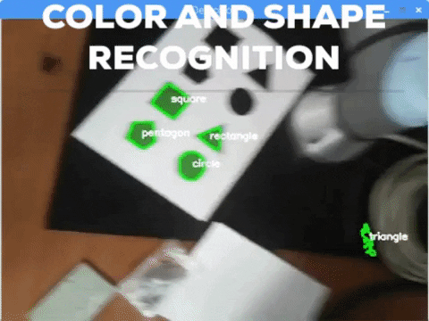

# Alternative programming method for UR robotic arms
This project's objective is not to create a real full-operative alternative to the current programming methods for industrial robots but to propose an idea developing a Proof of Concept to show that this approach could have potential.

The project has 2 main parts:
* **3D-printable case** to contain and protect the Raspberry Pi, a camera, a distance sensor and a fan. It also makes it possible to attach the whole system to the UR robot wirst
* **Python scripts** to program the robot and make it able to replay the teached movements

Demos of the target segmentation (color and shape filtered) and of the final results (target tracking and following and trajectory reproduction) are available in the following **YouTube videos**:

## 3D case
I started attaching just the Raspberry and a camera to the wirst of the robot using flanges and adhesive tape to make some initial test and trials. I then developed a really simple 3D printed mounting that made it possible a more solid (yet **provisional**) attach between the robot and the two devices mentioned before. This mounting was composed by this two plates:

   
  

Then, after advancing with the code, I started designing a **final version of a new case**. It will be adapted to the needs I met during the developement (such as including a distance sensor) and, obviously, will include general improvements such as a more aesthetic finish, more protection, ventilation, better and more solid coupling:

  
  

   

## Scripts
As mentioned in the introduction, there are two scripts: *programar.py* and *reproducir.py*.
* ***programar.py*** tracks the centroid of the biggest green triangle perceived by the camera. I convert to HSV, threshold and use the Ramer-Douglas-Peucker algorithm to classify shapes. Then, the neeeded cartesian corrections to center the centroid in the frame are calculated. Finally, they are written in a file and sended to the robot, which will solve the inverse-kinematics to reach the new target.

* ***reproducir.py***. This script does the same that *programar.py* substituting the computer vision and corrections calculation for just reading a line of the file. The aquired data is then sent to the robot so that it will behave as it did during the programming.
